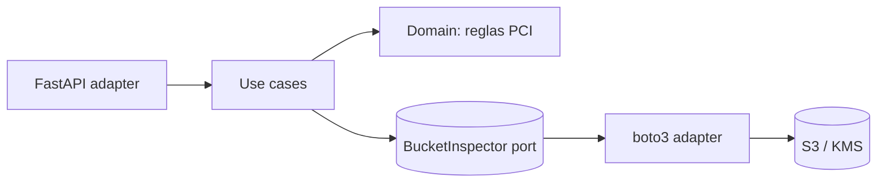

# Construction: diseno y tareas

## Diseno hexagonal

Regla de dependencia: `adapters -> application -> domain`. El dominio no importa boto3 ni FastAPI.

## Plan de tareas (cada una con prueba)
| # | Tarea | Validacion |
|---|-------|-----------|
| T1 | Modelo `BucketConfiguration`, `Finding`, `evaluate()` | `tests/test_audit.py` |
| T2 | Puerto `BucketInspector` y casos de uso | tests con fake inspector |
| T3 | Adaptador boto3 | pruebas con `botocore.stub.Stubber` (backlog) |
| T4 | Adaptador REST con validacion de entrada | `httpx.TestClient` (backlog) |
| T5 | Dockerfile non-root + manifiestos K8s | `kubeconform`, Trivy |

## Compuertas humanas
- [x] Revision de arquitectura (dependencias solo hacia el dominio)
- [x] Revision de seguridad (entrada validada, permisos de solo lectura, sin secretos)
- [ ] Aprobacion de despliegue a prod
