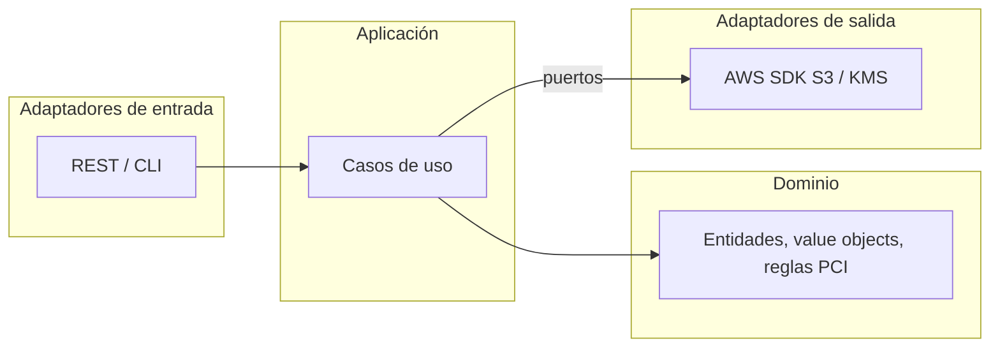
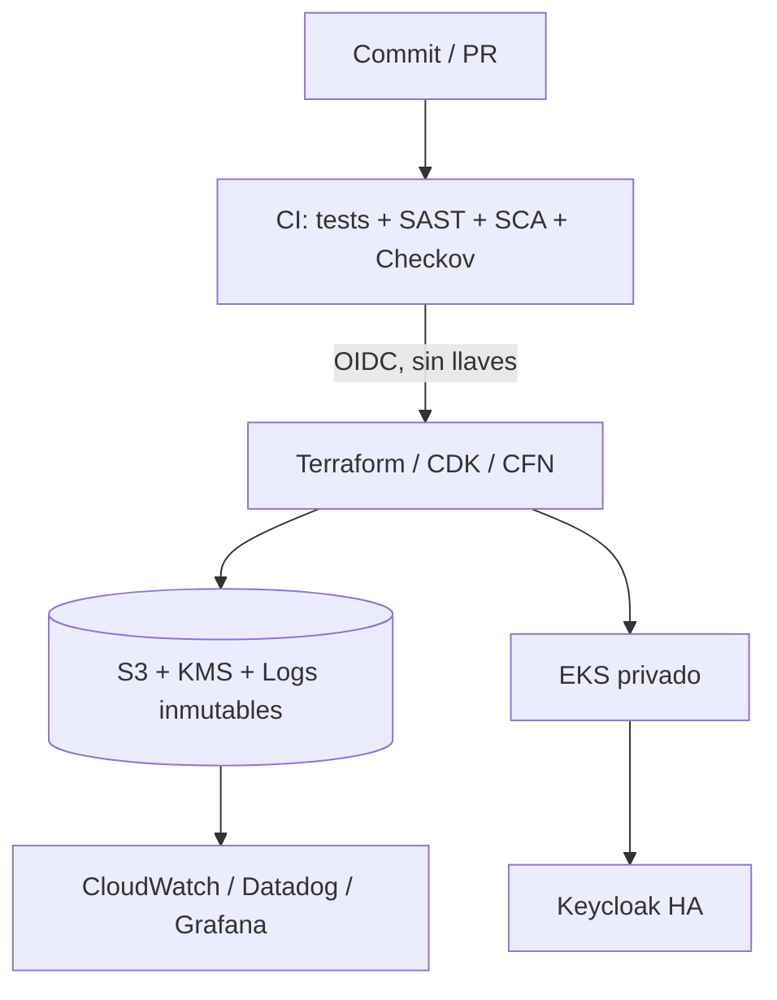

# Arquitectura

## Hexagonal (servicios Java y Python)

**Regla de dependencia:** las flechas solo apuntan hacia el dominio. El dominio no conoce frameworks ni AWS.

## Despliegue

## Well-Architected: cómo se refleja cada pilar
| Pilar | Evidencia |
|-------|-----------|
| Excelencia operativa | IaC, pipelines, runbook AI-DLC, dashboards |
| Seguridad | KMS, TLS, Object Lock, OIDC, NetworkPolicy, PSS restricted |
| Confiabilidad | Versionado, réplicas + PDB + HPA, topology spread |
| Eficiencia de rendimiento | Bucket Keys, HPA, contenedores slim |
| Optimización de costos | Lifecycle a Glacier, expiración de versiones, tags de costo |
| Sostenibilidad | Autoescalado, imágenes mínimas, lifecycle de datos |
