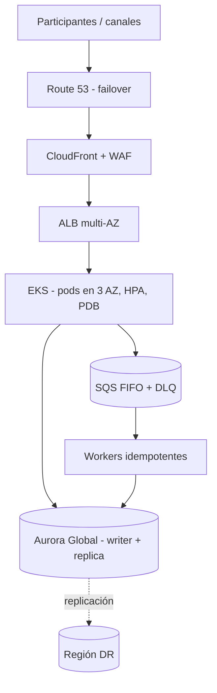

# Arquitectura de referencia: pagos de alta disponibilidad

> Genérica, inspirada en patrones de pagos en tiempo real. **No contiene información de ningún cliente.**

## Decisiones clave
| Tema | Decisión | Razón |
|------|----------|-------|
| Idempotencia | `idempotency-key` por mensaje, guardada en la BD | Evita doble débito con reintentos |
| Desacople | SQS FIFO con DLQ | Absorbe picos y aísla fallos |
| RPO/RTO | RPO < 1 min, RTO < 15 min (Aurora Global + failover Route 53) | Operación crítica |
| Datos sensibles | KMS CMK por dominio, TLS 1.2+, tokenización | PCI DSS 3 y 4 |
| Observabilidad | SLO de latencia/errores, alarmas, trazas | Detección antes del impacto |
| Resiliencia | Pruebas de caos y ejercicios DR trimestrales | Validar RTO/RPO reales |

La cola cifrada con DLQ está en [`queue.tf`](queue.tf).
